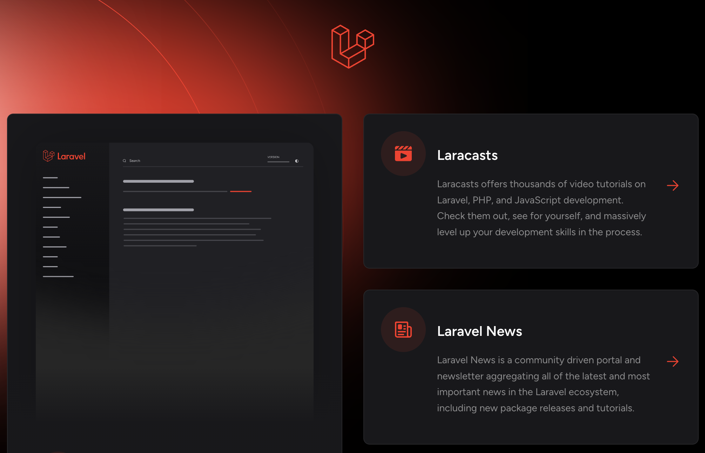
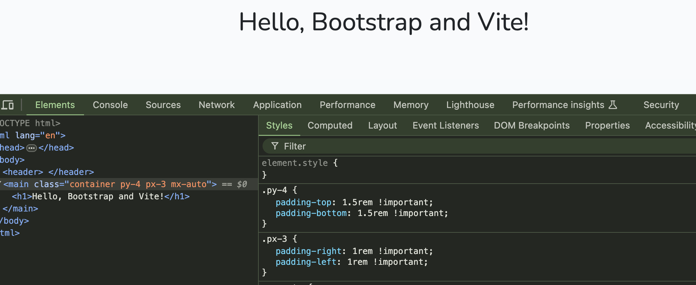

# ecommerce-laravel
Another E-commerce built with Laravel Framework

## Development Environment
Be sure to have Composer, Perl and PHP interpreters installed on you local environment.

You may check them by digiting below commands in command line:

```sh
which perl
which composer
which php
which mysql
```

You should see something like this:

```sh
/usr/bin/perl
/usr/local/bin/composer
/usr/local/bin/php
/usr/local/mysql-9.0.0-macos14-x86_64/bin/mysql
```

You also may check the program version by digiting following commands:

```sh
perl --version
composer --version
php --version
mysql --version
```

You should see something like this:

```sh
This is perl 5, version 30, subversion 3 (v5.30.3) built for darwin-thread-multi-2level ...
Composer version 2.6.3 2023-09-15 09:38:21
PHP 8.3.9 (cli) (built: Jul  2 2024 14:10:14) (NTS) ...
mysql  Ver 9.0.0 for macos14 on x86_64 (MySQL Community Server - GPL)
```

## N.B.

You probably might not have installed one ore more of previously programs list.

You have to install the missing program and then/or check environment `$PATH` variable by digiting the below command. 

```sh
 echo $PATH
```

You may see all available programs from command line:

```sh
/usr/local/bin:/usr/local/mysql-9.0.0-x86_64/bin:/Users/[your_username]/.composer/vendor/...bin
```

If you do not see the program folder path, you migth add it by digiting the missing folder path at the specific Operation System bash file:

In my case, the `/etc/paths` file.

## Laravel Installation
Please follow the laravel installation web page at [laravel installation page](https://laravel.com/docs/11.x/installation).

After installation you have to edit `.env` file to declare which is your username and password for the Data Base

```txt
...
DB_DATABASE=ecommerce
DB_USERNAME=root
DB_PASSWORD=[your_user_root_password]
...
```

Then you have to create the database `ecommerce` by using `mysql` program on command line.

```sh
mysql> mysql --user=root --password
Enter password: [your_user_root_password]
...
mysql> SHOW DATABASES;
+--------------------+
| Database           |
+--------------------+
| information_schema |
| mysql              |
| performance_schema |
| sys                |
+--------------------+
...
mysql> CREATE DATABASE ecommerce;
Query OK, 1 row affected (0.08 sec)
...
mysql> USE ecommerce;
Database changed
...
mysql> SHOW TABLES;
Empty set (0.01 sec)
...
mysql> EXIT;
```

Then remember to migrate your database (because  ecommerce database is empty now) by digiting the below command. .

```sh
php artisan migrate
0001_01_01_000000_create_users_table .......... 169.24ms DONE
0001_01_01_000001_create_cache_table ........... 21.67ms DONE
0001_01_01_000002_create_jobs_table ............ 54.40ms DONE
```

If you check the database now, you may see the migrated tables:

```sh
mysql> SHOW TABLES;
+-----------------------+
| Tables_in_ecommerce   |
+-----------------------+
| cache                 |
| cache_locks           |
| failed_jobs           |
| job_batches           |
| jobs                  |
| migrations            |
| password_reset_tokens |
| sessions              |
| users                 |
+-----------------------+
```

Let' start the server now and have a look at welcome web page on `http://127.0.0.1:8000/`

```sh
php artisan serve 
```

<p style="margin: 0 auto; width: 60%;">
    
</p>

## Bootstrap installation
Please follow the Node JS interpreter installation web page at [Node installation page](https://nodejs.org/en/download/package-manager/current).

Be sure to install the LTS version for your specific Operation System (and choose NVM)

You may check them by digiting below commands in command line:

```sh
which node
which npm
```

You should see something like this:

```sh
/usr/local/bin/node
/usr/local/bin/npm
```

You also may check the program version by digiting following commands:

```sh
node --version
npm --version
```

You should see something like this:

```sh
v18.19.1
10.2.4
```

You are ready to add Boostrap on your project now

Please follow the `laravel/ui` module installation by following [this page](https://laravel.com/docs/7.x/frontend)

Below a summary of commands you have to run
```sh
composer require laravel/ui     ## it installs the UI module
php artisan ui bootstrap        ## it updates some config files
npm install && npm run build    ## it installs Boostrap and builds the new resources
```

Edit your main `blade.php` file by using this below:

```html
<!DOCTYPE html>
<html>
  <head>
    ...
    <!-- It is useful for modern devices to set a default Content Width -->
    <meta name="viewport" content="width=device-width, initial-scale=1">
    <!-- It is used to load bootstrap resources. Please look at vite.config.js file -->
    @vite(['resources/sass/app.scss', 'resources/js/app.js'])
  </head>
  <body>
    <!-- the Main tag is using the new classes whish are coming from Bootstrap! -->
    <main class="container py-4 px-3 mx-auto">
        <h1>Hello, Bootstrap and Vite!</h1>
    </main>
  </body>
</html>

```

Let' start the server now and have a look at new web page on `http://127.0.0.1:8000/`

and see the new Bootstrap classes applied

```sh
php artisan serve 
```

<p style="margin: 0 auto; width: 60%;">
    
</p>
